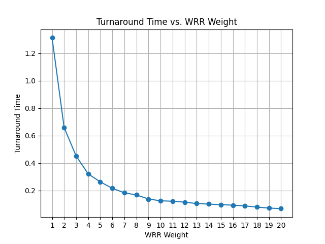

[](https://classroom.github.com/a/_-wGDd5L)
Linux kernel
============

There are several guides for kernel developers and users. These guides can
be rendered in a number of formats, like HTML and PDF. Please read
Documentation/admin-guide/README.rst first.

In order to build the documentation, use ``make htmldocs`` or
``make pdfdocs``.  The formatted documentation can also be read online at:

    https://www.kernel.org/doc/html/latest/

There are various text files in the Documentation/ subdirectory,
several of them using the Restructured Text markup notation.
See Documentation/00-INDEX for a list of what is contained in each file.

Please read the Documentation/process/changes.rst file, as it contains the
requirements for building and running the kernel, and information about
the problems which may result by upgrading your kernel.


## WRR Scheduler

We implemented a weighted round-robin scheduler in `kernel/sched/wrr.c` to
replace the existing CFS scheduler. To facilitate this scheduler, we maintain
the following data in the WRR RQ structure:

```c
// kernel/sched/sched.h
struct wrr_rq {
	struct list_head	head;
	atomic_t		total_weight;
	unsigned long		wrr_next_balance;
};
```

The `head` field is a linked list that holds the runnable tasks in a FIFO order.
We also track the total weight of all runnable tasks in the runqueue in
`total_weight`. The `wrr_next_balance` field is an optimization that avoids lock
contention during load balancing, as explained below.

With this data structure, the implementation of the WRR scheduler becomes
straightforward. We simply enqueue, dequeue, and requeue tasks into the WRR list
as needed, using the existing kernel list API. The core scheduler logic in
`kernel/sched/core.c` handles most of the necessary lock acquisition for us.

### Load Balancing

For load balancing, we perform a global load balancing operation every two
seconds, triggered from `scheduler_tick()`. As the load balancing logic is
called concurrently from each CPU, it must be synchronized with glbal spinlock.

Since acquiring a global spinlock on every call to `scheduler_tick()` just to
check a timestamp would be very costly, we perform a minor optimization. We also
hold the next_balance timestamp on every runqueue, which can be compared with
`jiffies` without acquiring any locks.

Once it is determined that the load balancing logic should be performed, we
iterate over every CPU search and transfer the max weight task from the max
total-weight runqueue to the min total-weight runqueue.


### Test Program

The test program can be found in `test/test_main.c` and `test/test_factorize.c`.
Compiling these two files and executing `./test_main 20` will create 20 processes 
of `test_factorize` and run them. The `i`th `test_factorize` process is assigned 
a WRR weight of `i`. It factorizes a large number repeatedly, printing out a log 
message for every number factorized along with its WRR weight.

To test the turnaround time of the factorization routine, we ran `./test_main 20` 
for approximately 20 minutes and collected the logs generated by the 20 
`test_factorize` programs. Subsequently, we counted the number of logs printed out 
by each `test_factorize` process and used this data to calculate the average time 
for each process to factorize a number. An example log can be found at 
[test/test.log](./test/test.log). In each line, the first number represents the 
WRR weight of the process that generated the log line.

The log file was parsed and analyzed with the following command:

```bash
grep -P 'P\d+: At time \d+: ' test.log | awk '{print $1}' | sort | uniq -c | sort -nr
```
Although this command ignores some output lines that were not synced properly and
mixes output from multiple programs, we decided that these lines are not frequent
enough to significantly affect the final result.

The final results are shown below.


| Program WRR Weight | Factorization Count | Turnaround Time(s) |
|--------------------|---------------------|-------------------|
|        20          |        17653        |       0.068       |
|        19          |        16750        |       0.072       |
|        18          |        15202        |       0.079       |
|        17          |        13577        |       0.088       |
|        16          |        12936        |       0.093       |
|        15          |        12368        |       0.097       |
|        14          |        11873        |       0.101       |
|        13          |        11379        |       0.105       |
|        12          |        10423        |       0.115       |
|        11          |        9828         |       0.122       |
|        10          |        9589         |       0.125       |
|         9          |        8713         |       0.138       |
|         8          |        7135         |       0.168       |
|         7          |        6555         |       0.183       |
|         6          |        5565         |       0.216       |
|         5          |        4564         |       0.263       |
|         4          |        3737         |       0.321       |
|         3          |        2658         |       0.451       |
|         2          |        1821         |       0.659       |
|         1          |         914         |       1.313       |




From the experiment, it's observed that the turnaround time is approximately 
inversely proportional to the WRR weight. This outcome is reasonable, as the 
timeslice assigned to each process is proportional to its WRR weight. Since each 
process must wait for other processes in the runqueue to complete their timeslices 
before it can run again, the turnaround time should theoretically be inversely 
proportional to the WRR weight. Additionally, the load balancing routine tries to
ensure that the load on each CPU is balanced, so the turnaround time should 
converge to the theoretical value as the experiment runs longer and more
load balancing operations are performed.
